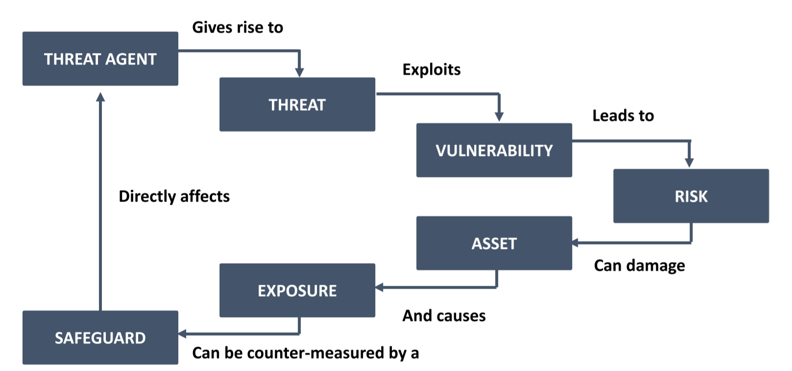
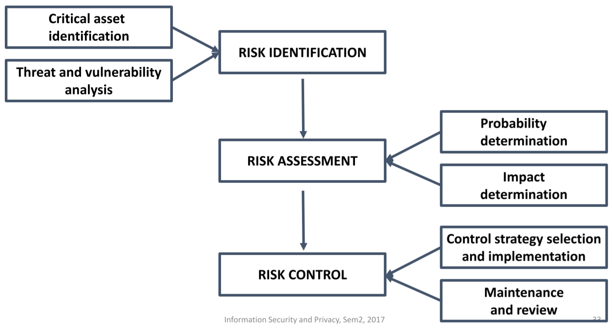
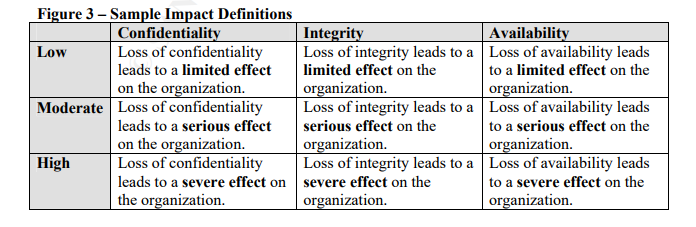
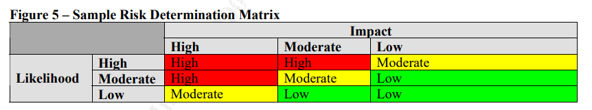
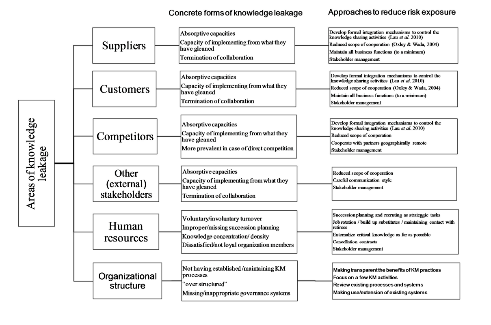

# Infosec
## Course Outline 


## TOC
<!-- TOC -->

- [Infosec](#infosec)
  - [Course Outline](#course-outline)
  - [TOC](#toc)
  - [Guest Lecture on Infosec - Key Points](#guest-lecture-on-infosec---key-points)
  - [Introduction to Security and Privacy](#introduction-to-security-and-privacy)
    - [What is Infosec](#what-is-infosec)
    - [The Definition of Infosec](#the-definition-of-infosec)
      - [Other Definitions](#other-definitions)
    - [Properties of a secure system](#properties-of-a-secure-system)
    - [CIA](#cia)
      - [The Additional Security Principles/Security Goals](#the-additional-security-principlessecurity-goals)
    - [Secrecy and Confidentiality](#secrecy-and-confidentiality)
    - [Privacy and Anonymity](#privacy-and-anonymity)
    - [Authentication](#authentication)
    - [Cryptography and Encryptions](#cryptography-and-encryptions)
    - [Vulnerabilities, Risks, Controls](#vulnerabilities-risks-controls)
    - [Privacy, Anonymity, and Security](#privacy-anonymity-and-security)
    - [Assets, Threats, Vulnerabilities, Risks](#assets-threats-vulnerabilities-risks)
    - [Data, information and knowledge](#data-information-and-knowledge)
    - [Common Threats to Infosec](#common-threats-to-infosec)
  - [Managing Security Risks](#managing-security-risks)
    - [Risk Management](#risk-management)
    - [Infosec Control Concepts](#infosec-control-concepts)
      - [SETA - Security Education Training and Awareness](#seta---security-education-training-and-awareness)
      - [Infosec Policy](#infosec-policy)
      - [Infosec Strategy](#infosec-strategy)
  - [Security Analysis](#security-analysis)
    - [Principles](#principles)
    - [Basic Security Analysis](#basic-security-analysis)
      - [Who/What Are We Protecting](#whowhat-are-we-protecting)
      - [Who/What is the adversary/threat](#whowhat-is-the-adversarythreat)
        - [The Common Adversary](#the-common-adversary)
      - [What are the security requirements](#what-are-the-security-requirements)
      - [Types of security strategies/approaches](#types-of-security-strategiesapproaches)
    - [Threat Models](#threat-models)
  - [Knowledge Leak](#knowledge-leak)
    - [Data vs Information vs Knowledge](#data-vs-information-vs-knowledge)
    - [Knowledge Leakage](#knowledge-leakage)
      - [Knowledge Leakage Risk](#knowledge-leakage-risk)
      - [Knowledge Leakage - Multidimensional Problem](#knowledge-leakage---multidimensional-problem)
      - [Knowledge Leakage Framework](#knowledge-leakage-framework)
      - [KLR (KL risk)](#klr-kl-risk)
      - [Prevention of Knowledge Leakage](#prevention-of-knowledge-leakage)
  - [Cryptography](#cryptography)
    - [Secret-key crypto](#secret-key-crypto)
    - [Public-key crypto](#public-key-crypto)
    - [RSA](#rsa)
    - [TLS and CAs](#tls-and-cas)
    - [Example: Maths and Democracy: Internet Voting](#example-maths-and-democracy-internet-voting)
        - [Security properties required](#security-properties-required)
    - [FREAK Attacks](#freak-attacks)
    - [End To End Encryption](#end-to-end-encryption)
      - [Diffie-Hellman: End to End](#diffie-hellman-end-to-end)
      - [Signed DH](#signed-dh)
      - [RSA Signing](#rsa-signing)
  - [Digital Signatures and Application of Cryptography](#digital-signatures-and-application-of-cryptography)
  - [Guest Lecture: Digital Privacy Rights, Then, Now and In The Future](#guest-lecture-digital-privacy-rights-then-now-and-in-the-future)
    - [Downsides to Encryption](#downsides-to-encryption)
    - [BDA and AI](#bda-and-ai)
  - [Digital Footprints and Privacy](#digital-footprints-and-privacy)
    - [Privacy](#privacy)
    - [Digital Footprints](#digital-footprints)
    - [Being Truly Anonymous is Hard](#being-truly-anonymous-is-hard)
    - [Dealing with Anonymity Issues](#dealing-with-anonymity-issues)
    - [Software to use](#software-to-use)
    - [Dollar vs Data Experiment](#dollar-vs-data-experiment)
    - [Customer privacy and security: Issues for business](#customer-privacy-and-security-issues-for-business)
    - [Trade offs between privacy and security and convenience](#trade-offs-between-privacy-and-security-and-convenience)
    - [How do you get people to give a shit about infosec?](#how-do-you-get-people-to-give-a-shit-about-infosec)
    - ["I don't have anything to hide!"](#i-dont-have-anything-to-hide)
  - [Privacy in the Modern World and Differential Privacy](#privacy-in-the-modern-world-and-differential-privacy)
    - [Security through Obscurity](#security-through-obscurity)
    - [Differential Privacy](#differential-privacy)
      - [Formal definition](#formal-definition)
    - [Data is valuable - to you and others](#data-is-valuable---to-you-and-others)
    - [Customers' privacy and security - issues for business](#customers-privacy-and-security---issues-for-business)
      - [How to keep privacy through good security with high adoption among users (Hasham, S et al. 2016)](#how-to-keep-privacy-through-good-security-with-high-adoption-among-users-hasham-s-et-al-2016)
  - [The Security Audit](#the-security-audit)
  - [Industrial Perspectives of Infosec](#industrial-perspectives-of-infosec)
    - [Political Influence in Infosec](#political-influence-in-infosec)
    - [SCADA](#scada)
    - [Gaining Information from People](#gaining-information-from-people)
    - [Why do organizations run old software?](#why-do-organizations-run-old-software)
    - [Realities](#realities)
  - [Additional Concepts](#additional-concepts)
    - [Australian Privacy Principles](#australian-privacy-principles)
    - [Defense in Depth](#defense-in-depth)
    - [Taxonomy of Privacy](#taxonomy-of-privacy)
  - [Case Studies](#case-studies)
    - [Election Hacking](#election-hacking)
    - [San Bernadino](#san-bernadino)
    - [Paula Broadwell and David Petraeous](#paula-broadwell-and-david-petraeous)
    - [Mass Surveillance](#mass-surveillance)
    - [IOT Technologies](#iot-technologies)
    - [Security Audits](#security-audits)
    - [Signal Et Al](#signal-et-al)
    - [Others](#others)
  - [Revision Notes](#revision-notes)

<!-- /TOC -->

## Guest Lecture on Infosec - Key Points 
- Legislators don't really hear from governments or the lobbylists - such as for the argument on getting security backdoors
- The government *avoids* using actual technical terms. - This allows them changing what they do
- The different committees have different infomration or knowledge of IT 
  - only a handful actually knows technical information, but they're stuck on commitees who can't make decisions
- In the US, Telecoms have to get a backdoor - but this hasn't been passed in tech companies
  - However, the US can collect data offshore or by satellite as they're not bound by the law 
- There's laws for messaging apps to be able to give backdoors or metadata
- The first attack of Paris: The most important encryption in the attack was the HTTPS used to encrypt the transaction with Airbnb
  - OPSEC in these operations are very basic, but...
  - They speak dialects of Arabics with hardly any translators for
  - For the time the data came out, there are only 2 Halsa translators in the entire NSA
  - If you're not gonna fix the translation side, fix that before you break comms - the human side is the bigger issue than encryption itself
- Election hacking: Elements around invading people's private information - what has and what hasn't actually happened, and what opportunities there are
  - Stealing emails: Even under 702, the US spies on other political parties. NSA and CIA worked together to hack the smartphones of Mexican parties. The US does hack political entities to figure out what's going on.
  - Fake news: Sort of crazy; Russians took up stories and made conspiracy stories (Pizzagate), and would send these. Congress is now looking at whether using Facebook, Russians sent emails to depress people in states that would win for Trump (as of writing these notes - Facebook and Twitter started releasing information of which advertisements were backed by Russian actors)
    - But only 0.1% of this malicious. The only way you get to this number is distinguishing Russians, Bernie voters, or reps
    - The debate is wheter the Russians or Republicans use American social media for propaganda
    - Facebook has incredible forensics of this stuff, tracking intelligences almost like intelligences themselves 
- How you would hack an election
  - Overreliance to analytics
    - You have to do things to do x y and z to win a state
    - But Hillary ignored it
    - The Hillary blue backpack: She relies in analytics too much to ignore what's in front of them
  - Mess with their analytics and monitoring
  - Interrupt the feedback loop
- How easy is it to hack US election machines?
  - It's true that we don't know if they machines were hacked, but the systems were not designed to provide good evidence if anything happens
  - The refusal to cooperate with whoever warns the victims are also a big question of trust.
- Why won't encryption be illegal?
  - At some point, if they realize they have the good society using crypto, it's preferable for everyone overseas to run it properly
- Is there a way to make decision makers make good decisions?
  -  The people who make decisions are by and large intelligence committees - and that's intoxicating
  - For most of them, they're intoxicated and believe the secrets are always true
  - Attitude of security about how stuff works and why gets supressed when we talk about crypto - but transparency about what happened, why and what went wrong is shunted in MILSEC, but it's an ordinary information
  - This attitude hasn't transfered across 

## Introduction to Security and Privacy
### What is Infosec 
Protecting assets against unwarranted access/disclosure/modification/destruction. We want to protect knowledge by protecting privacy/security of individual/organisation. 

Sensitive information: Information protected against unwarranted disclosure (to protect privacy/security of an individual/organisation)

We safeguard information through the use of:

- Compartmentalization
- Physical barriers/protection
- Legal protection
- Encryption


### The Definition of Infosec
- Infosec: Protecting information systems against misuse and interference from external parties 
  - Preventing unauthorized access, use, disclosure, disruption, modifiaction, inspection, recording and/or disruption of information
- It happens constantly that data, information and knowledge are leaked to competitors
- Lack of focus on infosec and knowledge leakage 
- "Building systems to remain dependable in the face of malice, error or mischance" - Ross Anderson

#### Other Definitions
- from Cherdantseva and Hilton
  - multidisciplinary area of study and professional activity
  - concerned w/ development and implementation of security mechanisms of all available types
    - technical, organisational, human-oriented and legal
  - in order to keep information in all its locations (within and outside the organisation's perimeter)
    - and, consequently, information systems, where information is created, processed, stored, transmitted and destructed,
  - free from threats
- in other words: defending information
  - preventing the unauthorised access, use, disclosure, disruption, modification, inspection, recording or destruction of information


### Properties of a secure system
- C Confidentiality
- I Integrity
- A Availability 

### CIA 
- Confidentiality
  - Ensuring information is exposed to authorized parties only, and that information is kept secret.
  - Subclasses
    - Privacy: Disclosing data according to a set of rules
    - Secrecy: Hiding data
- Integrity
  - Guarding against improper information modification or removal, and ensuring information accuracy, authenticity and nonrepudiation. Maintaining a correct state of data/information. 
- Availability
  - Timely ability to access and use information at all times.
- Additional
  - Authenticity
  - Accountability
  - Auditability 
  - Privacy
  - Nonrepudiation

#### The Additional Security Principles/Security Goals
Some of them are already covered by the CIA 

- Accountability
- Access control
- Assurance
- Reliability
- Effectiveness
- Efficiency
- Compliance
- Utility
- Posession/Control
- Authorization
- Awareness
- Access
- Identification
- Accuracy
- Administration
- Information Classification
- Anonymity
- Audit
- Safety


### Secrecy and Confidentiality
- Secrecy 
  - Keep data hidden
- Confidentiality
  - Keep someone else's data from unauthorized entities
- Australian Privacy Principles 
  - Read this shit 
  - Familiarize yourself with this shit
- Forward Secrecy
- Future Secrecy

### Privacy and Anonymity
- Privacy
  - Use/disclose a person's data according to a set of rules
  - Through the use of encryption and decryption, among other means
  - The objective is  safeguarding personal data
- Anonymity
  - Keep identity of a protocol participant secret 
- Integrity
  - Ensure data is correct, prvenintg unauthorized or improper changes

### Authentication
- Authentication/Identification: Verify identity of other participants
- Data authentication: Ensure that the data originates from claimed senders 

### Cryptography and Encryptions
- Cryptography: Enables secure information transactions between intended sender and intended recipient

### Vulnerabilities, Risks, Controls
- Vulnerabilities: weakness which allows an attacker to work around protection efforts
- Risk: **potential for loss**, damage, or destruction of an asset as a result of a threat exploiting a vulnerability
- Controls: Control, as in "means of limiting/regulating something". Set of managerial and technical controls to protect information resources.


### Privacy, Anonymity, and Security 
- Anonymity and Privacy are two different but related concepts
  - Anonymity is a subset of privacy
  - Different tools to get 
  - Encryption is good for privacy
  - Without very strong encryption, always assume comms are never just between intended parties
- Privacy and security are different
  - You need often need security to have privacy 


### Assets, Threats, Vulnerabilities, Risks
- 
- **Assets**
  - Something of value
  - People, property, information that supports information-related activities
- **Threats**
  - Potential danger than exploits a vulnerability
  - Can't be controlled and need to be identified
  - Has potential to compromise your asset 
  - Anything that can exploit a vulnerability, intentionally or accidentally, and obtain, damage or destroy the asset
- **Vulnerabilities**
  - Can be treated
  - Weaknesses that enables threat to work around protection efforts
  - The weakest links, things that can compromise our assets
  - Proactive measures should be taken
- **Risks**
  - Potential for loss/damage/destruction of an asset as a result of a threat exploiting a vulnerability
  - Can be mitigated or managed
  - Risk assessment -> Identify critical assets
  - Asset that has a vulnerability to be exploited by a threat, in consequence and likelihood
  - `Asset + Threat + Vulnerability = Risk`

### Data, information and knowledge
- Fahey and Prusak: data, information and knowledge compared
  - data: raw facts and no
  - information: processed data
  - knowledge: personalised information, value-added information
- can be thought of as a cycle
- data -> information
  - processing, analysing
- information -> knowledge
  - internalised: absorbed by mind
- knowledge -> information
  - externalised: verbalised/illustrated
- information -> data
  - captured and stored
- tacit knowledge: knowledge that is not easily expressed
- explicit knowledge: formal and systematic - easily communicated and shared, documented
- cycle
  - explicit knowledge -> tacit knowledge: internalisation
  - internalisation -> socialisation
  - tacit -> explicit: externalisation
  - externalisation -> combination
- cycle (2) (Alavi and Leidner 2001)
  - knowledge -> information: when it has been codified (made explicit) into artefacts
  - possible to infer knowledge from information
- knowledge (Davenport and Prusak 1998):
  - fluid mix of framed experience, values, contextual **information** and expert insight that provides a framework for evaluating and incorporating new experiences and information
  - originates, is applied in the minds of "knowers"
  - organisations - embedded not only in docs/repos but also in routines/processes/practices/norms

### Common Threats to Infosec
 
Categories | Examples
-|-
Acts of human error or failure | Accidents, employee mistakes. Human error is all about mistakes in putting in or accessing information
Compromises to intellectual property | Piracy, copyright infringement. Property or works which are intangible and requires legal protection. It's your responsibility to put the copyright on things. 
Deliberate acts of espionage or tresspass | Hiring someone from the competitor to leak trade secrets, unauthorized access and/or data collection, grey/black hat and shoulder surfing, competitive or industrial espionage. Unauthorized access/data collection
Deliberate acts of information retrieval and extortion |  Steals information and demands money or compensation for its return or nondisclosue
Deliberate acts of sabotage or vandalism | Political, protests, hacktivists, nation state hackers. 
Deliberate acts of theft | Compromising information and stealing resources, trade secrets, physical theft, or intellectual property
Deliberate software attacks | Malicious attacks, such as viruses, worms, backdoors, etc
Forces of nature | Uncontrollable events and natural disasters
Deviation of service | Internet service, communications, and power irregularities
Hardware Failure | Hardware screws up and shit
Software Failure | Software commits suicide
Techincal obsolences | Old stuff


## Managing Security Risks
*"Security is mostly a superstition, life is either a daring adventure or nothing."*

- Today's security risks
  - Drones weaponized
    - Until people have to defend against it 
  - Encryption clash between governments
  - Russian hacks lmao
  - Overreliance on IOT
  - Leaking of Private Information
  - Integrity of Information
    - Automated misinformation or falsified information as a compromise

Threats can't be controlled, and you can't do much to identify them. In order to minimize the risk of an attack, you have to identify them.

### Risk Management

- **Identify**
  - What's the assets we want to protect
  - Contextual analysis
  - Vulnerability analysis
  - May have residual risks: Risk remains on asset even after existing controls are applied
  - Common threat sources 
    - natural threats - floods, earthquakes, hurricanes
    - Human threats - unintentional and deliberate attacks
    - Environmental threats - power failure, pollution, hazmat
- **Assess**
  - Relative **Risk** of each vulnerability
    - Quantitative and qualitative methods
    - Quantitative = Loss expectancy = (Single Loss Expectancy)*(Rate of Occurence)
      - Single Loss Expectancy means the value of loss of the asset. 
  - Impact vs Likelihood
    - **Impact** in dollars and cents 
      - Depends on the risk, not the asset 
      - e.g. cost of confidentiality attack is different to an availability attack
    - **Likelihood** of the threat manifesting
      - Can be calculated from a number of sources (past incidents, experience, simulations, expert heuristics)
    - **Organization Effect**: How much it will change or hinder business operations
- **Response**
  - What you actually do when it happens
- **Control/Risk Management**
  - For each threat, create list of control ideas
  - Formal: Risk management, Policies, Access Control
    - Access control: Mandatory or discretionary. Can be based on authority in organization, or based by role or task
    - **Risk control strategies** - control each risk by: 
      - Safeguards (**avoidance** - preferred approach), 
      - transfer the risk (**transference**), 
        - Think of insurance companies
      - reduce impact by incident response plans (**mitigate**) 
        - Incident response plan
        - Disaster recovery plan
        - Business continuity plan
      - understand and accept (**acceptance**)
  - Risk control strategy chosen from
    - Level of threat and value of asset
    - If vulnerability exists and can be exploited
    - When attacker costs are less than potential gain
    - When potential loss is substantial
    - When cost of control < cost of impact
  - Informal: SETA
  - Technical
- **Maintenance or Review**: How are we doing now? Should we review where we stand?





### Infosec Control Concepts
#### SETA - Security Education Training and Awareness
- Foster a culture of security
- Influence the security behaviors of employees
- Draws its aims and objectives from security policy and security strategy
- Once an organization has conducted a comprehensive security risk assessment, a critical aspect of crafting the risk mitigation strategy is to determine how to use SETA to complement formal controls and technical controls.

#### Infosec Policy
Course of action that conveys instructions to those who make decisions, take actions and perform other duties. They can be strategic level or operational level. Also called practices/procedures

#### Infosec Strategy 
Future course of security actions to be enacted upon using a range of formal, informal and technological controls at a tactical and operational level tor educe security risk.

- Prescriptive: Involves decision making abaout a future course of action
- Multi-faceted and incorporating tradeoffs


## Security Analysis 
### Principles
- **Specification**: What are systems supposed to do
- **Implementation**: How does it work?
- **Correctness**: Does it actually work?
- **Human Nature**: Can the system survive "clever" users

### Basic Security Analysis
#### Who/What Are We Protecting
- Get information of **asset value**
- Understand the system architecture and how it works
- What is the operating value? How much will we lose if the resource dies?
- What is the replacement cost? How long would it take to replace it?
- What is the replacement cost if you lose it, and how long would it take to replace it?

#### Who/What is the adversary/threat
##### The Common Adversary
- Attacker **action**
  - Passive (just there waiting or unintentionally recovering exploits - eavesdropping)
  - Active (for malicious purposes - data injection)
- Attacker **sophistication**
  - Script kiddies vs the CIA
- Attacker **access**
  - External attacker - no prior knowledge of resources
  - Internal attacker - knows all information of crypto, complete access
- Attacker **impact**
  - The result of the compromise


#### What are the security requirements
- Confidentiality
- Integrity
- Authenticty
- Availability
- Auditability
- Access control
- Privacy
- etc...

#### Types of security strategies/approaches
- **No security**
  - Legal protection or patents
- **Strong defense**
  - Technical means of defense
- **Resilience to attacks**
  - Redundanacy
- **Detection, recovery and countermeasures**
  - Intrusion detection
  - Redundancy and backups
  - Response takes appropriate corrective actions against threats
- **Countermeasure**
  - Preventive countermeasure are barriers
  - It prevents attackers from getting access of data behind it
- **Prevention and Detection**
  - Passive defense
  - Not all measures are physical 
  - Hardest strategy to implement and often the most expensive - including physical protection
  - Experts can still find target
- **Deterrance**
  - Employ disciplinary actions to influence human behavior
  - Influenced by certainty and severity of sanctions
  - Giving punishments from violations may stop insider threats
- **Surveillance**
  - Systematic monitoring of the security environment towards developing situational awareness
  - Assist to adapting in changing circumstances and threats 
  - Monitoring activity logs, CCTV footage
- **Deception**
  - Distraction
  - Honeypots
- **Perimeter defense**
  - Physical boundary
  - Actual enclosures of servers 
  - **Firewalls**
- Compartmentalization
  - Different target zones secured separately
  - DMZ
- **Layering**/**Defense in Depth (DiD)**
  - Multiple barriers that complement each other
  - Predicated in the belief that a single strategy is insufficient
  - Another backs it up if one fails 

### Threat Models 
- You can't protect against everything
  - May be too expensive or inconvenient to cover everything
  - benefit < cost
- Identify most likely ways a system can be attacked - the weakest links
  - **Likely attackers and their resources** 
    - Dumpster diving or nation states
  - **Identify consequences**
    - Embarrasment vs bankruptcy
  - **Design measures accordingly**
    - Accept that they will not defendd against all attacks 

The target is the asset, not the defenses. Figure out your weakest links. 


## Knowledge Leak 
### Data vs Information vs Knowledge 
- You can know what to do, but it doesn't mean you know how to do it
  - Information vs Knowledge 
- Tacit knowledge: Not so easily expressed. highly personal, hard to formalize and difficult to comunicate to thers
- Explicit knowledge: Is formal and systematic. It can be easily communicated and shared
- Definition of knowledge
  - Documents, repos, designs, anything that gives contextual information that gives out a competitive advantage.
  - They take into configuration assets, computers, systems, people, organization culture

### Knowledge Leakage
- accidental or deliberate loss or unauthorised transfer of knowledge
  - knowledge intended to stay within an organisation's boundary that may weaken
- Intentional
  - Disclosure of knowledge`
  - Copy of organizational sensitive content
- Unintentional 
  - Accidental emails to recipeints
  - Loss of staff
  - Outsourcing/joint ventures
  - Employee oversight
  - Poor business process
  - Risky behaviors
    - Posting confidential details on social media
    - Click on phishing emails URLs unwittingly and download attachments from unknown sources
    - Connecting to open WiFi networks
    - Selection of poor security controls or bypassing of controls
- Focuses on confidentiality out of the three


#### Knowledge Leakage Risk
- Measure of the extent to which an organziation is threatened b a potential knowledge leak circumstance or event, and typically in a function of
  - Adverse impacts sthat would arise if the KL circumstance occurs, in dollars and 
  - Likelihood of the occurance

#### Knowledge Leakage - Multidimensional Problem
- Human Dimension - most important
  - Personal context
  - Social context
- Organizational Dimension
  - Environmnetal context
  - Organizational context
- Technical Dimension
  - Device context
  - Technical context

#### Knowledge Leakage Framework
**In SMBs**


#### KLR (KL risk)
- extent to which an org is threatened by a KL event
  - function of impact and likelihood
  - KLR = KL impact x KL likelihood

#### Prevention of Knowledge Leakage
- personal context
  - develop trust
  - use deterrents (punishments/sanctions)
  - weed out high risk people/positions
  - user behavior analytics
  - gamification (simulation) - see what could go wrong
  - SETA
  - decoy campaigns
  - quote from CEO: if people are weakest link, education is the strongest link -> education program
- social context
  - mobile security culture - habits
  - deterrants
  - communities/portal (tips, reminderse, HR mood boost)
  - peer mentoring - encourage asking questions
- organisational context
  - mobile risk management framework - IDing valuable knowledge assets - who knows what
  - standards, policies, procedures (for mobile workers)
  - legal
  - embed security into knowledge processes to protect when using mobile devices
  - knowledge governance: HRM dealing with tacit knowledge
  - roles for Knowledge Protection
  - protecting knowledge flows
  - embed extra complexity into process
  - constant monitoring to *mobile* workers dealing w/ sensitive knowledge
  - knowledge management strat
  - resilience capability - handle impacts
  - knowledge reconfiguration: combine knowledge assets to create new knowledge
  - multi-disciplinary integration
- environment
  - cooperate between orgs
  - factors to deter knowledge transfer
  - market analysis
  - analyse competitors/adversaries
  - counter-intelligence
  - policies for off-site work
  - conversation and behaviors outside company
- devices
  - MDM
  - encryption
  - geolocks
  - sandboxing
  - remote admin
- technical
  - enterprise mobility strategy
  - mobile device usage analytics
  - knowledge compartmentalisation
  - classification - tagging/labelling
  - auth, control, tracking of documents

## Cryptography 
- sending messages that are secret from everyone but intended recipient(s)
- encryption: "hiding" message for sending, so no one else can understand it
- decryption: "un-hiding"
- symmetric: one key for both encrypting and decrypting
- asymmetric: public-private key cryptography

### Secret-key crypto
- sender and receiver agree on key in advance
- use same key for encrypting/decrypting
- e.g. AES - still in use

### Public-key crypto
- asymmetric: only one party can read the sent messages
- receiver generates 2 keys:
  - public key *e* for encrypting
  - private key *d* for decrypting
- receiver publicises the public key *e*
  - people encrypt messages sent to the receiver using *e*
- receiver keeps private key *d* secret
  - to decrypt messages
- use
  - exchanging a secret key for secret-key cryptography


### RSA
- receiver thinks of 2 large numbers p, q
	- about 300 digits long
	- she multiplies them together to get N=pq
	- she generates the public key e (almost any e will do)
	- she publicises (N, e). This is her full public key
- to encrypt message m, compute
	- m<sup>e</sup> mod N
	- (this means take the remainder when m<sup>e</sup> is divided by N)
- the receiver can decrypt because she knows p and q
	- Euler-Fermat Theorem
	- nobody else can factorise N. The computation takes too long
- what if it’s a yes/no for elections?
	- w/o padding, identical input messages result in identical outputs (thus the meaning is not properly encrypted)
	- to encrypt message m,
		- pad m with a carefully chosen random string r
			- make 2 identical messages look different so the hacker can’t tell they’re the same message
		- compute (m || r)<sup>e</sup> mod N

### TLS and CAs
- Transport Layer Security 
  - Add integrity and pepper with potential secrecy 
  - Check the public key of the website you're talking to, to check if that public key actually does belong to that domain 
 checks the public key of the website you are visiting: if it does belong to the organisation that owns this URL
- CAs and Root Certificates 
	- **Digital signature**: something who the person who holds the private key can compute on the message
    - RSA signatures computed with the private key
		- and then can use the public key to verify that the person with the private key signed the message
	- built-in certificates in our PCs: root certificates
		- CA signs the statement that a website’s public key is as such
- How the Chain of Trust breaks 
  - CAs trickeed into issuing certificates
  - CAs being compromised
- Example of bad CA choice: WA Electoral Commission
  - CA isn't actually the electoral commission's, but some cloud service
  - TLS certificate can be issued from one CA to many sites
  - If domain name doesn't match, there's an error 
  - CA Alt Name - allowance to use the same certificate for all these sites
- It's important to realize you don't know your root CAs
  - If you work for an organization and evenif it's your machine, if you use BYOD or free wifi, you have an MBM setup which applies restrictions to your machine. But it will also install a certificate. That certificate is typically an intermediary that can sign certificates as anything else.
  - Organizations do this all the time, and intelligence services do it (but get caught up when people audit the CA)
  - Every government ask as it sees fit
  - You can't set up constraint of how power can be used. Once it's out there, it's out there.
  - What can these be misused for? What powers does it give that we won't have any control over?
  - It's over once Pandora's Box is open

### Example: Maths and Democracy: Internet Voting
- in 2015, NSW ran a trial of an electronic voting system
- TLS certificate looked pretty good at that time
- checked crypto libraries, etc. - didn’t find anything wrong
- Alex had the idea of looking not at the main page, but at everything else the internet connection was pulling
	- 5 little pieces of js
	- at the time it was coming from a 3rd party foreign company
		- serving analytics code into the web browser
		- meant to offer information about where voters were getting stuck on the web pages
- 3rd party company was not as careful about privacy as the main iVote page
	- 3rd party company had configured their server insecurely
	- 512 bits long public key
		- possible to intercept the traffic, decrypt the key, expose how everyone who passes through that route voted, changed their vote

##### Security properties required
- **verifiability**: no one can manipulate the output
  - only eligible voters vote, only once
  - voters should get evidence that their vote was cast as intended and counted as cast
  - everyone gets evidence votes were properly tallied
- **privacy**: coercers cannot manipulate the inputs e.g. by blackmail
- achieving both is hard, especially for remote voting

### FREAK Attacks
- a huge part of the strength of RSA is the length of the prime numbers
- first some history
	- around the 1990s, US gov’t restricted the export of strong crypto, in particular of RSA using more than 512-bit keys
	- so lots of servers (and clients) maintained the option to use “export grade” crypto, just in case they had to communicate with a restricted computer
		- everyone else has to deal with this stupid restriction - account for the possibility of having to communicate with the “export grade” restricted servers/clients
		- enforcement stopped, but
	- unfortunately, many still do (or did until very recently)
		- many servers used the same 512-bit key over and over again
- also, there was a bug in the TLS client for a large fraction of browsers
	- where they would accept the export-restricted key even if they haven’t asked for it
- client: I’d like to use 1024/2048 bit RSA
- attacker modifies message to “I can only use 512 bit RSA”
	- impersonates the web server
	- what does it mean for the attacker to completely impersonate the server?
		- once they’ve factorised the 512 bit key
		- they can, from then on, they can act like the server in every attempt to connect
- server responds w/ 512 bit RSA-EXP key (with valid certificate chain)
	- unfortunately the server keeps serving the same key over and over
		- (not refreshing the key)
- buggy client: accepts 512 bit key, uses it to encrypt
	- buggy since the client did not offer 512 bit in the first place
- attacker can use the factored 512-bit key to control the SSL/TLS session
	- decryption does not actually happen on the fly
- 512-bit “export-grade” RSA now costs about $100 to break running overnight on Amazon’s EC2 cloud

### End To End Encryption
- The way it should be
  - Encrypt messages so that only the receiver can read 
- In contrast to services such as Gmail or Facebook
  - Servers have access to the content you've written

#### Diffie-Hellman: End to End
- Alice and Bob
- everyone knows (part of the protocol)
  - a prime *p*
    - another large prime (300 or 600 digits)
  - a generator *g*
- secret
  - Alice has a secret *a*
  - Bob has a secret *b*
- Alice computes A = g<sup>a</sup> mod p
- Bob sends to B = g<sup>b</sup> mod p
- Alice sends big A to Bob
- Bob sends big B to Alice
  - big letters are sent in a way that anybody can read it
- once we’ve agreed on a shared secret, we have a key to use for symmetric cryptography
- shared secret: g<sup>ab</sup> mod p
  - how can Alice compute this from little a and big B?
    - S = B<sup>a</sup> = (g<sup>b</sup>)<sup>a</sup> = g<sup>ab</sup> mod p
  - Bob
    - S = A<sup>b</sup> = (g<sup>a</sup>)<sup>b</sup> = g<sup>ab</sup> mod p
  - what’s the big assumption?
    - remember that in RSA: prime numbers are hard to factorise
    - here, the big assumption (discrete log assumption)
      - hard to compute a from A and b from B, even if you know all the other parameters
- Somebody who has one of the secrets can possibly calculate it 

#### Signed DH
- Alice and Bob agree on g and p (large prime) as before
  - George (adversary) learns about g and p too
- Alice generates a secret a and sends A = g<sup>a</sup> mod p to Bob
  - and signs A with her private signing key
- Bob generates a secret b and sends B = g<sup>b</sup> mod p to Alice
- When Bob receives A from Alice, he checks her signature (using her public key) to make sure A is really from her
  - takes care of the possibility of a MiTM attack
- Alice and Bob computes S = g<sup>ab</sup> mod p as before
- Bob sends Alice a message encrypted with their shared key S, using, for example AES
  - AES(message, sharedKey)


#### RSA Signing
- *d*, computed from *p* and *q*
  - totient: lcm of (p-1) and (q-1)
  - d: modular multiplicative inverse of e (mod totient)
    - d x e mod totient = 1
- signing: holder of private key has a value d with the property (x<sup>e<sup>d</sup></sup> = x (mod N))
  - getting at d is equivalent to factorising N
  - verify signature: S<sup>e</sup> = Pad(Hash(M)) (mod N)
    - M: message
    - N: public key component

## Digital Signatures and Application of Cryptography 
```
(m * a + b) mod c = d
let k be any integer
k * c + d = m * a + b
m = (k * c + d - b)/a

With one m, we can try to calculate k (the hash) to get different messages 

Now suppose  a = 1 
What clashes with the 0 message?

- Both m = c and m = 0 
- First because everything falls through c as it is divided by c

```

- "Mathematical link between a message and a public key"
- Sign through private keys, and verify through public keys
  - CAs issue some digital signatures on some public keys
- High entropy - any message will have different digests 
  - Fixed-length hash
  - Has to be computationally infeasible to find two messages that hash to the same digest
    - and that's why we need the hashes to be long
  - If it is feasible, then we can have different 
- Digital signing algorithm works in the digest itself
- Signature collisions make good malware
  - Flak malware: Mess with digital signature that comes from software updates
- Critical to have hash functions where nobody can compute the same values - that's why MD5 and SHA1 is going out
- Two ways to deal with secrets 
  - Diffie Hellman
    - Usually with a new key 
    - Fresh values every time they communicate
    - Suspectible to MITM
  - RSA
    - If public key is fucked, everything else is fucked 
    - But we don't really much on this when we follow best practices of getting higher primes - it is computationally infeasible to break those
  - They are possible to exchange over SSL/TLS
- Desirable Properties of Secret Messages
  - Resistant to MITM
  - **Forward secrecy**: When the current key is compromised, past communications are secure
  - **Future secrecy**: When the current key is compromised, future communication stays secure 
  - In general this is achievable via the use of ephemeral keys 
- Ratcheting Protocol
  - Diffie Hellman plus long term memory of public key exchange when contacts first met
- Extended Triple Diffie Hellman Protocol (Signal)
  - https://www.reddit.com/r/netsec/comments/5bg3f4/x3dh_extended_triple_diffiehellman_key_exchange/
  - What Signal uses 
  - This is the key agreement protocol that Signal uses. It uses three Diffie-Hellman key agreement phases in a way that allows users to communicate securely, providing both confidentiality and integrity & authenticity, without giving away that they communicated (plausible deniability), or allowing an attacker to recover plaintext messages from previously captured encrypted communications even if they later steal the users' private key materials (forward secrecy). It is also designed in a way that prevents the server from compromising communications between the user - the worst the server can do is refuse to cooperate with the key exchange and communications by not sending messages.
  - A key feature that is important to Signal's communications model is that this exchange is asynchronous, i.e. it can begin while one of the users is not connected to the Signal network, and later complete when the other user comes online, even if the other user has since gone offline.
  - Signal uses 3DH + hash ratcheting + optional rekeying with 3DH.
  - As a recipient, you have a list of signed asymmetric ephemeral keys stored on your behalf by your server.
  - The person contacting you requests an ephemeral public key for you, and verifies the signature. He computes key exchanges between [his permanent private key + your ephemeral public key], [his ephemeral private key + your ephemeral public key] and [his ephemeral private key + your permanent public key].
  - The three outputs are mixed to generate a seed. This seed is iterated (deleting past seed values) in a PFS manner using the hash ratchet for every message.
  - Rekeying mixes the 3DH key exchange outputs with the existing iterated seed value.
  - Both people know they're talking to the right person because they got the same output from all three key exchanges and thus both knows the respective private keys from the long term keypairs and ephemeral keys.
  - And yet a falsified conversation is indistinguishable from a real one to somebody without ALL the keys!

## Guest Lecture: Digital Privacy Rights, Then, Now and In The Future 
### Downsides to Encryption
- There are very few downsides to HTTPS unless if you need to perform surveillance. 
- We don't necessary think it's good for people to monitor what we are doing
- During the San Bernadino case, the iPhone cracking was just a stage play to win the debate; they got the data from unencrypted backups anyway, they just wanted to try win the case.

### BDA and AI
- How much of AI hype is real, and how much is just speculation?
- False positives in neural network analysis of bail settings 
  - Even they have biases to races...
  - ML algorithms are making it worse these days
  - The problems come from
    - Algorithms being trained on broken data - you're training the machine to be racist
    - The minute variable bias: If you have a ML system to predict something would be true in the future. When there is a true model probability, the things that actually drive it are usually not accessible to the model. 
    - False correlation: "Driving at night is dangerous" because of all the data about crashes at night.
- Equal Opportunity Machine Learning - how to correct out biases on known groups of people with biases 
  - You need a list of the protected categories of your data - gender, age, ethnicity...
  - It's still in research, but once you're out in the world and applying ML, you have to know the bias of the data (and hence your system) and apply measures to ignore these biasing data.
- Examples:
  - The Public School debacle
    - Algorithms that fire teacher based on incentives of passing kids
    - Schools just teach things that they will be examined on and nothing elses. Teachers would also cheat. 
  - PageRank: Figuring out which pages are authoritive

## Digital Footprints and Privacy 
- Invasion of Privacy can be Episodic or Systemic
- Freedom from surveillance neede for an informed and reflective citzenship
- Privacy has economic role in innovation, sheltering processes of play and experimentation from which innovation emerges

### Privacy
Cohen (2013) - "What Privacy Is For"
- "legal scholarship has conceptualised privacy as a **form of protection for the liberal self**"
- **state of being free from unwanted or undue intrusion or disturbance in one's private life or affairs**
- invasion of privacy can be episodic or systematic
- argues that freedom from surveillance is needed for an informed and reflective citizenship
- privacy has an economic role in innovation: it shelters the processes of play and experimentation from which innovation emerges
- Regimes of pervasively distributed surveillance and modulation seek to mold individual preferences and behavior in ways that reduce the serendipity and the freedom to tinker on which innovation thrives.
  - Modulation: exerting a modifying/controlling influence on something
  - it is modulation, not privacy by itself that poses the greater threat to innovative practice.


### Digital Footprints
- You're leaving tons of it around
- Anonymity and Privacy are two different but related concepts 
- How digital footprints are left behind
  - Work habits
    - Cursor trackers
  - Metadata
  - Tagging on Facebook
  - Strangers sharing location and taking pictures
  - Business and services 
  - I know where your cat lives 
- No you can't just turn off your phone
- Governments
  - NSA TAO
  - Who knows how long it's been there 
  - DROPOUTJEEP - software implant on iPhones by the NSA 
  - Government actors are a different level of actors
  - Spying on journalists - Paul Farrell from The Guardian put into investigation with 200 pages of reports
  - NSA DISHFIRE: Collecting SMS every day 
- Practical ways to improve privacy
  - Check and update privacy settings, especially on mobile apps 
  - Turn off settings that share information that is unecessary for the service

### Being Truly Anonymous is Hard
- IP address always transmitted
- Browser tranmists information about the browser config
- Browser history and cookies
- Cloud services that will probably still ahve your data
- Data mining and inference techniques
- Nations can already have deliberate policies to remove anonymity
  - Collection of phone numbers, phone calls, text messages
  - Thailand provides tracking SIM cards to visitors 
- Printers print out small yellow dots to encoded to identify printers

### Dealing with Anonymity Issues 
- Always assume you have less anonymity and privacy when you do things electronically 
- Give out as much personal info as needed 

### Software to use
- Spideroak
- Ricochet
- Signal
- Keypass
- Keybase
- Authenticators
- Yubikeys (sans the PGP support - because it's currently fucked)

### Dollar vs Data Experiment
- How much is your personal private information worth?
- How much is your personal data worth? It's actually pretty god damn worthless.
  - Packages of data are more important if it has very identifiable data 

### Customer privacy and security: Issues for business
- People want to feel their data is secure
- But it may be too clunky for the average user, which put them off.
- Even though data is kept appropriate, is it secure enough for privacy?
  - It's not necessarily that privacy is worse, but the amount of times that it happens is what matters
- Perhaps the most direct threat to maintain consumer trust is negative personal experience. Security breaches appear to be more common among the most intensive internet using households.

### Trade offs between privacy and security and convenience 
- McKinsey - auditing comapany
- 30 percent prioritize case and convenience over security
- Want basic level operating behind the scenes but say 'having access to account information without the need to enter a password is attractive or very attractive'
- People hate OTPs
- Login credeintials should be the same - SSO
- Better UX matters
- Inconsistent design, poor error messaging, clunky communications, site slowness or unavailability makes it less ppealing to the end user to accept security
  - e.g. Keybase and Signal are perhaps the best applications of crypto we have these days that abstracts away all the hard parts of maintaining and signing PGP keys manually but they are still buggy, clunky, or slow to be widely accepted. 
- Privacy policy: A company's privacy policy describes how it gathers, uses, discloses and manages a consumer's information

### How do you get people to give a shit about infosec?
- Negative experience to launch them to give a fuck
- Better UX 
- Streamlined technicalities and procedures that easily blend to everyday life
- Good support

### "I don't have anything to hide!"
In a sense, you don't need your boss to know why and where you go out with your workmates. Your company shouldn't know why you are in a meeting with the VP of another company even though you are just friends. Your corporate competitors doesn't need to know who you're lobbying and how long. Your insurance company shouldn't recalculate your premiums from knowing how your activity fares.

People think that if they only engage in legal activity, there's nothing they should worry about. 

"But I value national security more if it means sacrifice of my privacy"

"If they scrape our data, they won't even really see it until something interesting happens anyway, no privacy breach happens to until perhaps a few trusted government officials!"


## Privacy in the Modern World and Differential Privacy 
### Security through Obscurity 
- "You can't be attacked when people don't know you exist"
- Requires knowledge of data and information of software/infrastructure to attack against this
- The less you reveal, the better - don't reveal more than you have to to the world
  - Limit exposed information
  - What's the least information needed to get the job done
  - Obscurity doesn't mean indended is more secure 
- We're trying to answer "what is the least required amount of information to get the job done?"
  - Can violate the principle of simple means more secure
  - It's not always practical to have honeypots but it's not always the intention with the saying

### Differential Privacy
https://research.neustar.biz/2014/09/08/differential-privacy-the-basics/

The aim is to add random noise to distort data. The mechanism acts in such a way that tiny changes in the dataset does not change the output by much, so that any individual can claim they have never contributed to the dataset. This suggestion is plausible given that attackers only query the database through several specified means a limited number of times. 

Baseline principle: Flip a coin. If it's heads, answer honestly. If it's tails, flip it again and answer depending if it's heads or tails.


```
        Y    Say No
Truth
Y       3/4  1/4
N       1/4  3/4

Suppose x says yes, 1-x says no
Truth = (x-1/4) * 2
      = 2x - 1/2


```
- We're trying to hide information of that one person, by arguing that if the person is added to the database, it's not going to change anything to the data
- We add randomness to the data to make sure that it doesn't change very much when real responses are taken out to preserve some privacy
- In particular, this allows us to protect queries against *one* individual in this definition
- We're trying to hide information of that one person, by arguing that if the person is added to the database, it's not going to change anything to the data
- It attempts to shield the conclusion that *any one individual* is within a dataset even by comparing two distinct datasets, with or without that individual. 
- how does this protect someone's privacy?
  - cannot be sure what every single person in the dataset answered thanks to the random noise
    - said person can simply say "I got tails in the 1st coin and just answered whatever the coin told me to" even if they didn't: plausible deniability

#### Formal definition
- If for every 2 neighboring databases D1 and D2, the distributions returned by a mechanism M over D1 and D2 are close, the mechanism is differentially private. (Dwork et al 2006)
  - Explanation
    - The idea is: the mechanism does not return a precise value for every query towards the database. It returns an answer with random noise, usually from a probability distribution - so any answer given from the database is not precise.
    - In addition to that, the mechanism (usually a probability distribution over the data) is constructed in such a way that small changes in the input (say whether a person is missing or not from the dataset) only affect the output very slightly.
      - The idea is: any *one* person in the dataset can claim that he/she never contributed to it/said something else thanks to this random noise (as with the coin analogy above) - this preserves privacy of **individuals**
      - But overall, when it comes to returning the general distribution over the population, this mechanism does not return useless data!
- Mechanism: random function on a database
- Neighboring: 2 databases, R<sup>n x d</sup> differ in only one row

### Data is valuable - to you and others
- in every community, there is a necessary balance between the rights of the citizen and companies, particularly around privacy
  - is ours out of balance?
- dollar vs. data - experiment
  - how much is your personal information worth?
  - 3 characteristics that increase the value of your data?
    - ethnicity, job, marriage status, etc.
    - http://www.ft.com/cms/s/2/927ca86e-d29b-11e2-88ed-00144feab7de.html
- private info
  - how would it be valuable to others? Who do you think could use that information?
    - institutions? companies? the government? your friends and family? cybercriminals?

### Customers' privacy and security - issues for business
- customers want to feel their data is secure from unauthorised access and their privacy is kept intact
- ways of ensuring privacy through better security can be heavy-handed and clunky for average user
  - puts them off -> leads them to choose less secure options -> risking their privacy
- 2 issues
  - integrity of the company "harvesting" the data and using it, vs.
  - integrity/protection of that data from others

#### How to keep privacy through good security with high adoption among users (Hasham, S et al. 2016)
- device/no recognition, omnichannel auth
  - (customers don't want to be treated like strangers because they're on a different device)
- remaining 20% prefer a verification phone call
- log-in credentials should be the same across all channels
  - allow custs to logn in one channel to use another, eliminating duplicate auths
- better visual UX matters
  - inconsistent design, poor error messaging, clunky comms, site slowness or unavailability make it less appealing to the end user to accept security that will improve their privacy

## The Security Audit 
- Patch and update
- Strong, unique passwords using password managers  
- Encrypt data at rest
- Encrypt data in transit
- Enable MFA
- Additional steps
  - periodically check privacy settings and update them
  - turn off settings that share information unnecessary for use/service
  - Use HTTPS Everywhere, VPNs


## Industrial Perspectives of Infosec 
- In those early days of the internet, there's nothing of sort of what we face these days in the internet. 
- In infosec, think of how the adversary thinks
- Universities may actually have more data to protect than companies, with bigger security implications
- **IT Security is not just saying "no." It should empower people to protect their privacy.**
  - Because aside from secure, you want people to get shit done, too. 
  - People don't give a shit. If you stop people from getting things done, they will bypass you.
  - We need to make things easy for people to use, otherwise infosec fights the user
- Data sovereignity
  - Equifax has so much data going out and no means of actually detecting what went wrong
  - Data sovereignity is faced everyday, but we don't necessarily find it important
- Day do day we don't give a shit - what degree of convenience you are willing to give up

### Political Influence in Infosec 
- The senior guys at kaspersky are arrested by the Russian Government, following people in the intelligence that talked to the FBI. The government isn't fond of Kaspersky. 
- Congress takes so much money from lobbyists, who knows why the decisionn is made, and it's really just money.
- You can get trade wars over software
- Restrictions on exports of information is always a pain in the ass for years 
- There's two legislations for crypto: Give us a backdoor or a way to break at the endpoint
- Open source becomes the savior, but it comes back to inertia. People follow inertia rather than trying to get something kinky to run
- Software is intangible, so it's hard to restrict people from using software
  - e.g. the crypto wars
  - PGP was first printed to Australia as a fucking book
  - That was the only way to get PGP out of the US 
- Restrictions on exports of information is always a pain in the ass for years 
  - Legislations make it really hard for people to write legit crypto software
  - The words are considered as munitions in technology
- We are currently in an infosec cold war - we have proxy wars waged from breach of infosec protocols, such as the Iranian nuclear program hacks where they destabilize the centrifuge and blow it up while interrupting the feedback loop
- The Vault 7 and Shadow Brokers story.
  - If you look at the timing of what happened and you start inferring some stuff, you can draw interesting conclusions on who they may have been
  - Who likes dumping stuff for targeted effect? It's almost to show dollars and spotlight
  - Some of the attack kits left should not have been on servers
  - The NoBus: nobody but us.
    - Even our allies can't see it, only the US does
    - When you talk about means and bugs in software, the idea of only your guys will find the bugs is delusional
    - The flipside is, with Eternal Blue, when the NSA knew what was coming, it's almost certain NSA reached out to Microsoft and told them to patch their shit.
    - Only 91 days later it's exploited by WannaCry
    - The NSA and CIA knows already

### SCADA
- Supervisory Control and Data Acquisition
- Industrial and commercial level systems to control industrial machines. 
- Folks who can deal with SCADA are better compensated than professionals who don't give a shit
- It's more about what happens in terms of what stakes you have. If a mistake means 3 million people lose power, it brings an interest of its own
- In reality, people will opt for convenience. So while you may have a protocol barrier, there's no longer an air gap. 

### Gaining Information from People
- Human beings follow a similar activity during the day, following the same pattern. To gather intel, this sort of info is nice and easy.
- If we have enough metadata, we don't need the data. We kill people from metadata.
- A signature strike is through metadata signatures. You get Hellfire missiles up your ass from your DNS.
- Datacenters have people sharing smaller IP address spaces. Basically, one of the sites that got blocked blocks everything. 

### Why do organizations run old software?
- Only certain environments are certified for it, or equipments will no longer support it
- Also money
- People run things and expect them to run for years above the service contract
- While it's hard to blame institutions, questions must be asked of the manufacturer where people sweetspot profit on them by going minimal effort vs projected expectation of lifetime of use 
- People have to buy new shit. At what point can organizations be forced to replace things.
- Organizations make the tradeoff called where can I spend money for maximum effect. If there is not a perceived risk, they will not spend money there
- People will only do something when shit hits the fan


### Realities
- People will trade off convenience for infosec 
- **Zooko's Triangle**: Tradeoff of decentralization, security and usability

---


## Additional Concepts

### Australian Privacy Principles 
See markdown document outlining the APP. 

- 1: open and transparent management of personal information
- 2: anonymity and pseudonymity
- 3: collection of solicited personal information
- 4: dealing with unsolicited personal information
- 5: notification of the collection of personal information
- 6: use or disclousre of personal information
- 7: use/disclosure of personal info for direct marketing
- 8: cross-border disclosure of personal information
- 9: adoption, use or disclosure of government related identifiers
- 10: quality of personal information
- 11: security of personal information
- 12: access to personal information
- 13: correction of personal information
- not prescriptive, more stringent obligations on APP entities with access to sensitive info


### Defense in Depth
Basically means of control that provides defensive measures 

- Physical controls
- Technical controls
- Administrative controls

**Tools for DiD**

* Anti virus software
* Authentication and password security
* Biometrics
* Demilitarized zones (DMZ)
* Data-centric security
* Encryption
* Firewalls (hardware or software)
* Hashing passwords
* Intrusion detection systems (IDS)
* Logging and auditing
* Multi-factor authentication
* Vulnerability scanners
* Physical security (e.g. deadbolt locks)
* Timed access control
* Internet Security Awareness Training
* Virtual private network (VPN)
* Sandboxing
* Intrusion Protection System (IPS)


### Taxonomy of Privacy
Extra information from Solove, 2008

- Information collection
  - Surveillance
  - Interrogation
- Information processing
  - Aggregation
  - Identification
  - Insecurity 
  - secondary use
  - Exclusion
- Information dissemination
  - Breach of confidentiality
  - Disclosure
  - Exposure
  - Increased accessibility
  - Blackmail
  - Appropriation
  - Distortion
- Invasion
  - Intrusion
  - Decisional interference


## Case Studies
### Election Hacking
### San Bernadino
### Paula Broadwell and David Petraeous
- Communications discovered by capture of IP address 
- http://www.usatoday.com/story/tech/2012/11/13/petraeus-broadwell-email/1702057


### Mass Surveillance 
### IOT Technologies 
### Security Audits 
### Signal Et Al
### Others
- Cyber espinoage charges
- Snowden's revelations 
- Russian/Ukrainian hacking on major retailers, payment processors and banks

## Revision Notes 
- Relationship between Infosec, privacy and cryptography 
  - Make sure you understand the linkbetween the three topics. Understand the definitions, show how constructs relate with one another. 
  - Put things together - mind map it if you need it
- The What, why, when, who, where
  - **Why** is infosec important
  - **What** does it encompass?
  - **What** are we trying to protect and **how**?
  - What are the **threats** out there and how are they classified
  - **Where** did threats come from? What can be done about them? What happens if we ignore them?
  - Are the groupings really vital? Is it the same group of threats? Has it changed? What are the new infosec threat buzzwords?
  - Think about what it actually means in our daily lives. 
- Think about risks
  - Risks are inherent in every single workshop topic
  - Why does risk play such a big role in infosec discussion? What are the risks and how do we manage them
  - Risks are inherent. Try and get a grip of what it means and what it is that makes it so important in infosec
- What are organizations doing wrong? 
  - What are they doing right?
  - Why is it more important now than it was back then? Is it actually more important, or inherently more important?
  - Strategies that organizations can use to protect important information they need
  - Are we in the need of getting new strategies? 
- Contemporary topics
  - Knowledge leakage
    - It's becoming more interesting these days to everyone because it costs a lot of money. How is this different from data leakage and information leakage
    - Is it the same these days? 
  - Every definition we talk about, try to relate it to our workshops if it's not clear enough just yet.
- In the exams, the questions are very specific. To answer quickly, make sure something's on your mind. These are small questions that you need to come up with a solution fairly quickly, and just move on. Don't really reflect, just be able to get to a solution.
- Australian Privacy Principles matter
  - You'll need it to apply them in your jobs
  - Read this shit motherfucker holy shit, it may even come out on the exam
  - They have legal relevance, but also provide a guide for organizations which cgather or store data on their customers
  - There's an 11 page factsheet, read that shit motherfucker 
- IT Security audit
  - Includes research and knowing the different solutions available to security problems, and their strengths and weaknesses 
- IT Security breach case
  - Excellent case studies for understanding what has or can happen and go wrong
  - Get familiar and get to know how they can be prevented
- Metadata 
  - Few IT byproducts affect security and privacy as much 
  - Be sure you understand the social and legal matters around metadata 
- US and Five Eyes digital surveillance
  - More widespread than we think
  - Be sure you can dimension the nature and scope of the privacy intrusions
- Be sure you can explain why privacy is important
- Understand the barriers to IT anonymity. 

```
⠀⠀⠀⣴⣴⡤
⠀⣠⠀⢿⠇⡇⠀⠀⠀⠀⠀⠀⠀⢰⢷⡗
⠀⢶⢽⠿⣗⠀⠀⠀⠀⠀⠀⠀⠀⣼⡧⠂⠀⠀⣼⣷⡆
⠀⠀⣾⢶⠐⣱⠀⠀⠀⠀⠀⣤⣜⣻⣧⣲⣦⠤⣧⣿⠶
⠀⢀⣿⣿⣇⠀⠀⠀⠀⠀⠀⠛⠿⣿⣿⣷⣤⣄⡹⣿⣷
⠀⢸⣿⢸⣿⠀⠀⠀⠀⠀⠀⠀⠀⠈⠙⢿⣿⣿⣿⣿⣿
⠀⠿⠃⠈⠿⠆⠀⠀⠀⠀⠀⠀⠀⠀⠀⠀⠀⠹⠿⠿⠿

⠀⢀⢀⡀⠀⢀⣤⠀⠀⠀⠀⠀⠀⡀⡀
⠀⣿⡟⡇⠀⠭⡋⠅⠀⠀⠀⠀⢰⣟⢿
⠀⣹⡌⠀⠀⣨⣾⣷⣄⠀⠀⠀⢈⠔⠌
⠰⣷⣿⡀⢐⢿⣿⣿⢻⠀⠀⢠⣿⡿⡤⣴⠄⢀⣀⡀
⠘⣿⣿⠂⠈⢸⣿⣿⣸⠀⠀⢘⣿⣿⣀⡠⣠⣺⣿⣷
⠀⣿⣿⡆⠀⢸⣿⣿⣾⡇⠀⣿⣿⣿⣿⣿⣗⣻⡻⠿⠁
⠀⣿⣿⡇⠀⢸⣿⣿⡇⠀⠀⠉⠉⠉⠉⠉⠉⠁
⠀⠛⠛⠃⠀⠘⠛⠛⠃
```
